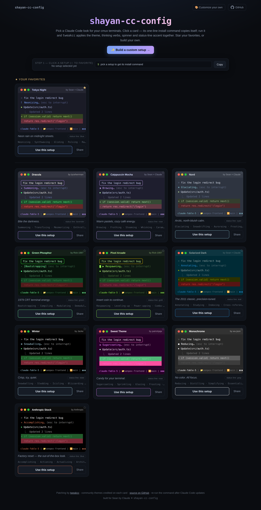

<div align="center">

# 🎨 shayan-cc-config

### A gallery of beautiful **Claude Code** setups for your terminal — pick one, run one command, done.

Colors · thinking verbs · spinner animation · status-line accent — all swapped together in one shot, powered by [`tweakcc`](https://github.com/Piebald-AI/tweakcc).

**▶ Live:  [shayan-cc-config.vercel.app](https://shayan-cc-config.vercel.app)**



</div>

---

## ✨ What is this?

`shayan-cc-config` is a zero-friction way to restyle [Claude Code](https://claude.com/claude-code) running in your terminal (built for [cmux](https://github.com/anthropics/cmux), works anywhere).

Instead of hand-editing config files, you:

1. **Browse** 11 hand-tuned setups — each rendered as a *live, animated terminal preview* so you see exactly what you're getting.
2. **Click one.** Its one-line install command copies itself to your clipboard.
3. **Paste + run** in any terminal. `tweakcc` patches Claude Code's `cli.js` with the theme, thinking verbs and spinner; the site also flips your `~/.claude.json` theme and syncs your status-line accent color.

Switch looks anytime by picking another card and re-running. Build your own in the [**customizer**](https://shayan-cc-config.vercel.app/customize). Star favorites. Share a setup with a link.

---

## 🚀 Quickstart (30 seconds)

```bash
# 1. Open the gallery, click a setup — the command is copied for you.
#    Or grab one directly:
curl -fsSL https://shayan-cc-config.vercel.app/apply/tokyo-night.sh | bash

# 2. Start a fresh Claude Code session. That's it. 🎉
```

> The command runs `npx tweakcc@latest --apply` under the hood — no global installs, nothing to clean up.

---

## 🖥️ Using a setup


Every card is a **real preview** — the spinner spins, the thinking verb cycles, the diff colors are the actual theme colors. When you click **Use this setup**:

- the exact install command lands in your clipboard and in the sticky bar at the top,
- you paste it into any terminal and hit enter,
- `tweakcc` applies it, the theme activates in `~/.claude.json`, and your status-line accent (`~/.claude/scripts/context-bar.sh`) is updated to match.

⭐ **Favorite** any card with the star — favorites float to the top and persist in your browser.

### Even easier: the `shayan` command

Install a tiny helper once and switch setups by name (or an interactive picker) from anywhere:

```bash
curl -fsSL https://shayan-cc-config.vercel.app/shayan.sh | bash
```

Then:

```bash
shayan               # interactive picker — arrow to a setup, hit enter
shayan dracula       # apply a setup directly by id
```

*(A double-click-friendly copy also lives in your Documents folder — `shayan.command`.)*

---

## 🎛️ Build your own — the Studio


The [**Studio**](https://shayan-cc-config.vercel.app/customize) shows two **fully interactive Claude Code terminals side by side — BEFORE (your current setup) and AFTER (your custom one)**. Both are real scrollable sessions with user messages, thinking spinners, tool calls, diffs and a status line. **Type a message into either terminal** (or fire a sample prompt) and watch both respond in their own style. Pick any preset as your "before" to compare against.

Everything you tweak updates the AFTER terminal live:

- **14-color palette** (background, text, accent, success/error/warning, and more) with native color pickers — start from Tokyo Night, Catppuccin, Nord, Solarized, Sunset or Matrix, or seed *everything* from any preset,
- **thinking verbs** (your own word list + format string, e.g. `{}… `) and **spinner** (braille, moon, circle, pulse, blocks, arrows, or fully custom phases) with speed slider + optional bounce,
- **your messages** — this is how you tell your prompts apart from Claude's output: format string (`" ❯ {} "`), bold/italic/underline/strikethrough/inverse, custom text + background colors, 11 border styles, padding, fit-to-content,
- **input box** — remove the border, tint the idle `>` chevron,
- **status line builder** — compose the bottom bar from segments (model, folder, git branch + dirty flag, context bar + %, session cost, duration, lines ±, output style, CC version, clock, custom text), reorder them, pick separators and bar styles, emoji on/off. The installer writes a real status-line script to `~/.claude/statusline-shayan.js` and registers it in `~/.claude/settings.json`.

When you love it:

- **Copy install command** — a self-contained command that encodes your whole setup, runs anywhere,
- **⭐ Publish to homepage** — your setup appears as a card on your gallery (saved in your browser),
- **🔗 Share link** — anyone who opens it lands in the Studio with your exact setup loaded.

Your work-in-progress is kept in the URL and in a local draft, so refreshing never loses it. Every preset card on the homepage has a **Customize** button that opens the Studio seeded with that setup; your published customs get an **Edit** button.

No account, no backend — your custom config travels inside the link and the install command.

---

## 🎨 The 11 built-in setups

| Setup | Author | Vibe |
|---|---|---|
| **Tokyo Night** | Sean × Claude | Neon rain on midnight streets |
| **Dracula** | tyceherrman | Bite the darkness |
| **Catppuccin Mocha** | Sean × Claude | Warm pastels, cozy café energy |
| **Nord** | Sean × Claude | Arctic, north-bluish calm |
| **Green Phosphor** | Rick-1997 | 1979 CRT terminal energy |
| **Pixel Arcade** | Rick-1997 | Insert coin to continue |
| **Solarized Dark** | Sean × Claude | The 2011 classic, precision-tuned |
| **Winter** | Jacke | Crisp, icy, quiet |
| **Sweet Theme** | patrickjaja | Candy for your terminal |
| **Monochrome** | wu-json | No color, all focus |
| **Anthropic Stock** | Anthropic | Factory reset — the out-of-the-box look |

Community themes come from [Piebald-AI/claude-code-themes](https://github.com/Piebald-AI/claude-code-themes); each setup adds its own themed thinking-verb pack and spinner.

---

## 🩹 Troubleshooting / no hiccups

<details>
<summary><b>I ran the command but nothing looks different</b></summary>

`tweakcc` patches `cli.js`, which is only read at startup. **Start a brand-new Claude Code session** (fully quit and relaunch) after applying.
</details>

<details>
<summary><b>Claude Code updated and my theme reverted</b></summary>

Every Claude Code update ships a fresh `cli.js`, which wipes the patch (your config in `~/.tweakcc/config.json` is safe). Just **re-run the same install command** (or `shayan <id>`) and you're back.
</details>

<details>
<summary><b>The status-line color didn't change</b></summary>

The installer only edits `~/.claude/scripts/context-bar.sh` if that file exists (it's a custom status line). If you use a different status line, set its accent manually — the theme + verbs + spinner still apply.
</details>

<details>
<summary><b>My custom status line didn't show up</b></summary>

The installer writes `~/.claude/statusline-shayan.js` and points `statusLine` at it in `~/.claude/settings.json` — it appears in **new** Claude Code sessions. To remove it, delete the `statusLine` key from `~/.claude/settings.json`.
</details>

<details>
<summary><b>"command not found: npx"</b></summary>

You need Node.js (which provides `npx`). Install it via [nodejs.org](https://nodejs.org) or `brew install node`, then re-run.
</details>

<details>
<summary><b>`shayan: command not found` after installing the helper</b></summary>

Open a **new** terminal (the installer adds `~/.local/bin` to your PATH), or run `export PATH="$HOME/.local/bin:$PATH"` in the current one.
</details>

<details>
<summary><b>I want to undo everything</b></summary>

```bash
npx tweakcc@latest --restore   # restores the original, unpatched cli.js
```
</details>

---

## 🔌 API

Everything is a plain HTTP endpoint — no auth, CORS-open, stateless.

| Route | Description |
|---|---|
| `GET /` | The gallery |
| `GET /customize` | The Studio — interactive before/after customizer (`?from=<id>` seeds from a preset, `?c=<blob>` opens a shared setup) |
| `GET /apply/:id.sh` | Installer for a built-in setup (pipe to `bash`) |
| `GET /config/:id.json` | The `tweakcc` settings JSON for a setup |
| `GET /apply.sh?c=<blob>` | Installer for a **custom** setup (palette encoded in `c`) |
| `GET /config.json?c=<blob>` | `tweakcc` settings for a custom setup |
| `GET /statusline.js?c=<blob>` | The generated status-line script for a custom setup |
| `GET /shayan.sh` | Installs the `shayan` CLI helper |
| `GET /list.txt` | `id⇥name` per line (used by the helper) |
| `GET /api/presets` | Full preset data as JSON |

---

## 🏗️ How it works

```
click card ──▶ copy  "curl .../apply/<id>.sh | bash"
                       │
                       ▼
            apply script runs on your machine:
              1. npx tweakcc --apply --config-url .../config/<id>.json
                   └─ patches cli.js: theme (61 colors) + verbs + spinner
              2. sets ~/.claude.json  theme = <id>
              3. sed-updates context-bar.sh  COLOR = <accent>
```

The whole site is a **single stateless Cloudflare-Worker-style handler** (deployed on Vercel). Custom setups need no database — the 14-color palette is expanded to `tweakcc`'s full 61-key theme on the fly (identical code runs in the browser preview *and* server-side, so what you preview is exactly what you get), and everything travels inside the URL.

### Develop & deploy

```bash
npm install
npx vercel dev          # local:  http://localhost:3000
node test.js            # smoke suite (routes, client JS, generated scripts, status line)
npx vercel --prod       # deploy
```

Presets are generated by [`build_presets.py`](build_presets.py) into `api/_data.js` (gzip-embedded).

---

<div align="center">

Patching by [**tweakcc**](https://github.com/Piebald-AI/tweakcc) (Piebald-AI) · community themes by their authors · built for Sean by Claude

<sub><code>shayan-cc-config</code> — because your terminal should look as good as your code.</sub>

</div>
